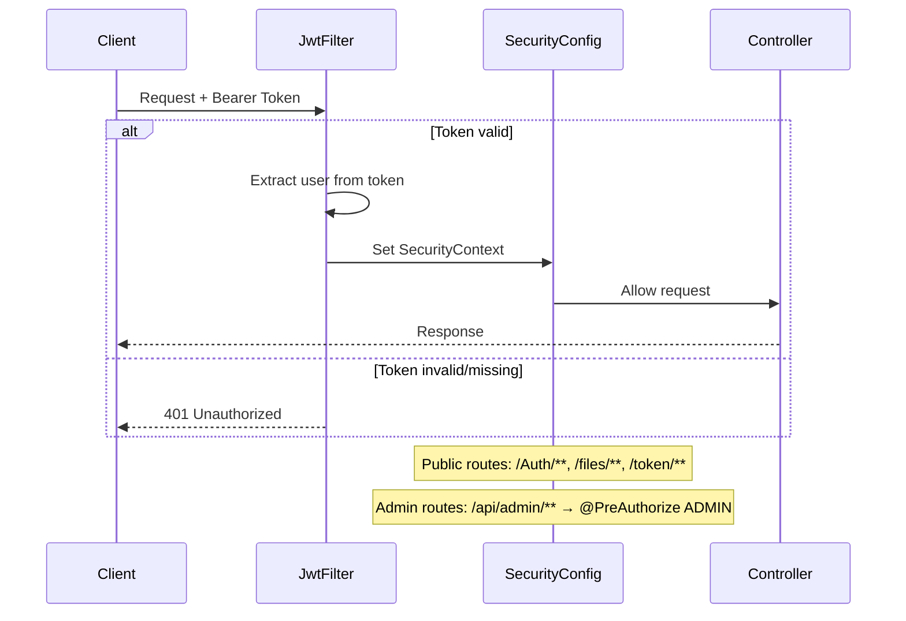

# 01BLOG — Backend (Spring Boot 3)

REST API server built with Spring Boot 3, Spring Security (JWT), and Spring Data JPA.

---

## 🏗 Architecture

```mermaid
graph LR
    subgraph Controllers
        AC[AuthController]
        UC[UserController]
        PC[PostController]
        CC[CommentController]
        FC[FolowController]
        NC[NotificationController]
        RC[ReportController]
        ADC[AdminController]
        TC[TokenController]
        FIC[FileController]
    end

    subgraph Services
        US[UserService]
        PS[PostService]
        CS[CommentService]
        SS[SubscriptionService]
        NS[NotificationService]
        RS[ReportService]
    end

    subgraph Repositories
        UR[UserRepository]
        PR[PostRepository]
        CR[CommentRepository]
        LR[LikeRepository]
        SR[Subscrepository]
        NR[NotificationRepository]
        RR[ReportRepository]
        TR[TokenRepository]
    end

    Controllers --> Services
    Services --> Repositories
    Repositories --> DB[(MySQL)]
```



---

## 📁 Package Structure

```
com.project.block/
├── BlockApplication.java         ← Main entry point
├── Controllers/                  ← REST controllers (10)
│   ├── AuthController            ← /Auth (Register, Login)
│   ├── UserController            ← /api/users (profile, update)
│   ├── PostController            ← /api/posts (CRUD, like, visibility)
│   ├── CommentController         ← /api/comments (get, add)
│   ├── FolowController           ← /api/users/{id}/follow
│   ├── NotificationController    ← /api/notifications
│   ├── ReportController          ← /api/reports (submit)
│   ├── AdminController           ← /api/admin (moderation)
│   ├── TokenController           ← /token/validate
│   └── FileController            ← /files/{filename}
├── entity/                       ← JPA entities (8)
│   ├── User, Post, Comment, Like
│   ├── Subscription, Notification
│   ├── Report, Token
├── dto/                          ← Data Transfer Objects
│   ├── ResposeData               ← Unified API response { message, status, data }
│   ├── UserDTO, PostDTO, CommentDTO, ReportDTO
│   └── UserProfile
├── models/                       ← Service layer (business logic)
├── repository/                   ← Spring Data JPA repositories
├── config/                       ← Security, CORS, app config
├── filters/                      ← JwtFilter (auth middleware)
└── util/                         ← TimeFormatterUtil
```

---

## 🔐 Security Pipeline



---

## 📦 Response Format

All endpoints return a consistent JSON shape:

```json
{
  "message": "Description of the result",
  "status": 200,
  "data": { ... }
}
```

**Error example:**
```json
{
  "message": "Post not found",
  "status": 404,
  "data": null
}
```

---

## 🗃 Entity Relationships

| Entity | Key Fields | Relations |
|--------|-----------|-----------|
| **User** | `user_id`, `username`, `email`, `password`, `role`, `banned` | → Posts, Comments, Likes, Subscriptions |
| **Post** | `id`, `title`, `content`, `media_url`, `status`, `likes` | → User (author), Comments, Likes |
| **Comment** | `id`, `content` | → User (author), Post |
| **Like** | `id` | → User, Post |
| **Subscription** | `id`, `follower_id`, `followed_id` | → User × 2 |
| **Notification** | `id`, `text`, `type`, `is_read` | → User (sender), User (recipient) |
| **Report** | `id`, `type`, `reason`, `reporter`, `targetId` | Reporter name, target ID |
| **Token** | `id`, `token`, `is_logged_out` | → User |

---

## ▶️ Running

```bash
# Prerequisites: Java 21, Maven, MySQL running
cd Backend/backendblock
mvn spring-boot:run
# Server starts on http://localhost:8080
```

### Configuration (`application.properties`)
- Database: `spring.datasource.url`
- File upload dir: `file.upload-dir`
- JWT secret: configured in security config
