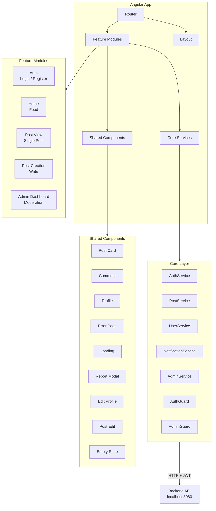
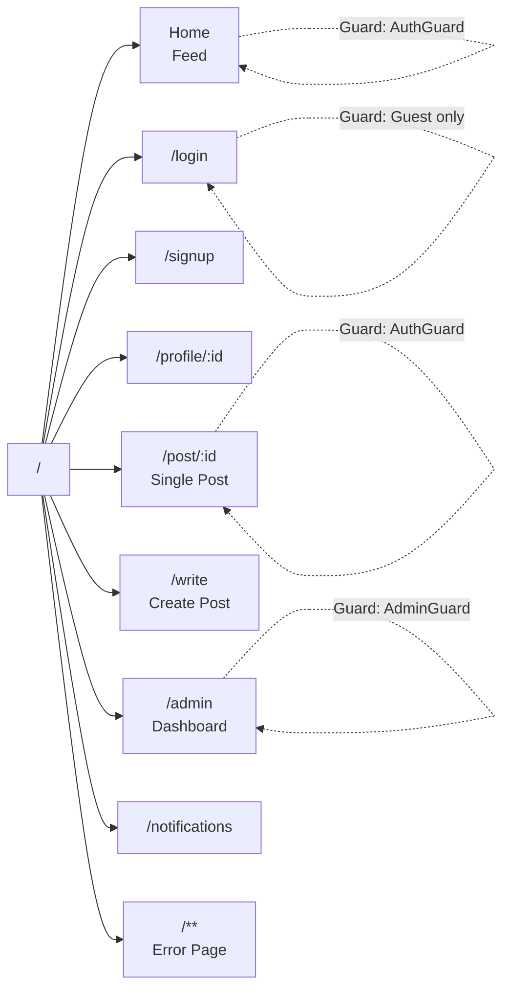
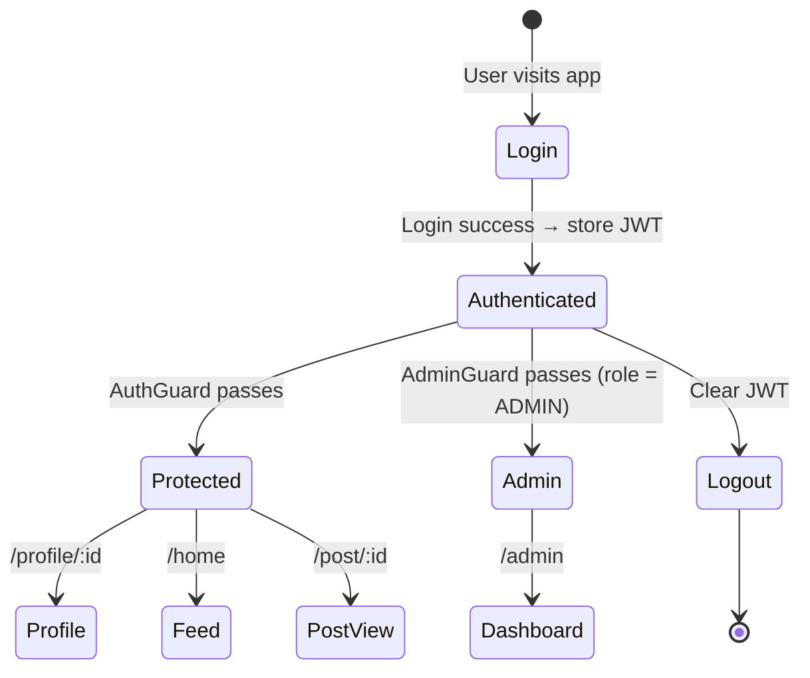

# 01BLOG — Frontend (Angular 19)

Single-page application built with Angular 19, standalone components, SSR support, and a custom vanilla CSS design system.

---

## 🏗 Architecture



---

## 📁 Folder Structure

```
src/app/
├── core/                         ← Singleton services & models
│   ├── services/                 ← API communication (7 services)
│   │   ├── auth.service.ts       ← Login, register, token management
│   │   ├── post.service.ts       ← CRUD posts, likes
│   │   ├── user.service.ts       ← Profile, follow, report
│   │   ├── admin.service.ts      ← Admin moderation API
│   │   ├── notification.service  ← Notifications API
│   │   ├── global.service.ts     ← Global state
│   │   └── report.service.ts
│   ├── models/                   ← TypeScript interfaces
│   │   ├── api-response.model    ← ApiResponse<T> { message, status, data }
│   │   ├── post.model.ts
│   │   ├── user.model.ts
│   │   └── admin.model.ts        ← AdminUser, AdminPost, Report
│   ├── guards/                   ← Route protection
│   │   ├── aut.guard.ts          ← Authenticated users only
│   │   └── admin.guard.ts        ← Admin role check
│   └── interceptors/             ← HTTP interceptors
│
├── features/                     ← Page-level feature modules
│   ├── auth/                     ← Login + Register pages
│   │   ├── login/
│   │   └── registre/
│   ├── home/                     ← Main feed
│   ├── post-view/                ← Single post view (/post/:id)
│   ├── post-creation/            ← Create new post
│   └── admin-dashboard/          ← Admin control panel
│
├── shared/                       ← Reusable components
│   ├── components/
│   │   ├── post/                 ← Post card component
│   │   ├── comment/              ← Comment display
│   │   ├── profile/              ← User profile view
│   │   ├── edit-profile/         ← Profile editor modal
│   │   ├── post-edit-component/  ← Post editor
│   │   ├── report-modal/         ← Report submission modal
│   │   ├── error-page-component/ ← Error pages (403, 404, 500)
│   │   ├── loading/              ← Loading spinner
│   │   └── empty-state/          ← Empty list placeholder
│   ├── pipes/                    ← Custom pipes
│   └── utils/                    ← Validation helpers
│
├── layout/                       ← App shell
│   ├── navbar/                   ← Top navigation bar
│   └── footer/                   ← Footer
│
└── app.routes.ts                 ← Route definitions
```

---

## 🛣 Routing



| Route | Component | Guard |
|-------|-----------|-------|
| `/` | Redirect → `/home` | — |
| `/home` | `HomeComponent` | `AuthGuard` |
| `/login` | `LoginComponent` | Guest only |
| `/signup` | `RegisterComponent` | Guest only |
| `/profile/:id` | `ProfileComponent` | `AuthGuard` |
| `/post/:id` | `PostViewComponent` | `AuthGuard` |
| `/write` | `PostCreationComponent` | `AuthGuard` |
| `/admin` | `AdminDashboardComponent` | `AdminGuard` |
| `/notifications` | `NotificationComponent` | `AuthGuard` |
| `**` | `ErrorPageComponent` | — |

---

## 🎨 Design System

- **Pure vanilla CSS** — no frameworks (no Tailwind, no Bootstrap)
- CSS custom properties for theming: `--stone-*`, `--brand-*`
- Google Fonts: Serif + Sans
- Responsive: mobile-first with `@media` breakpoints
- Micro-animations: hover effects, slide-up, fade-in

---

## 🔐 Auth Flow



---

## ▶️ Running

```bash
cd Frentend/Myapp
npm install
ng serve
# App runs on http://localhost:4200
# Backend must be running on http://localhost:8080
```
