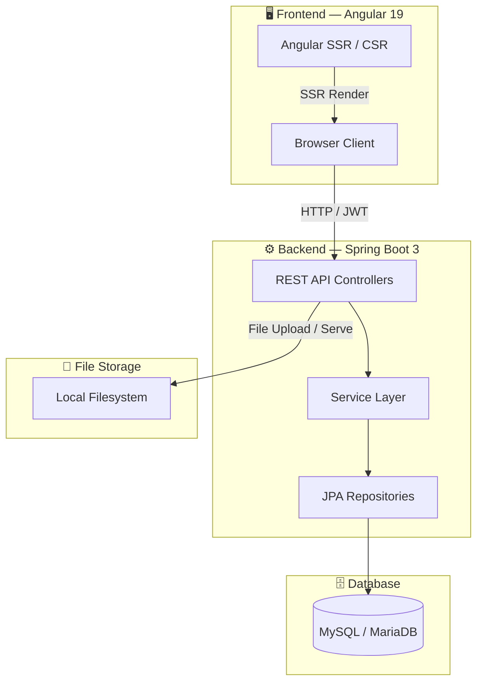
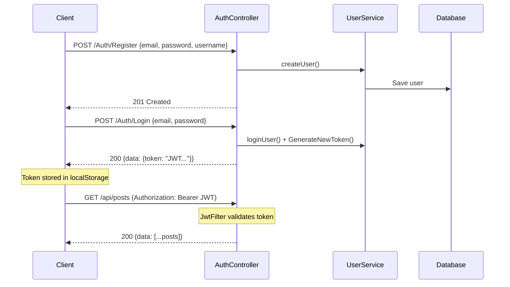
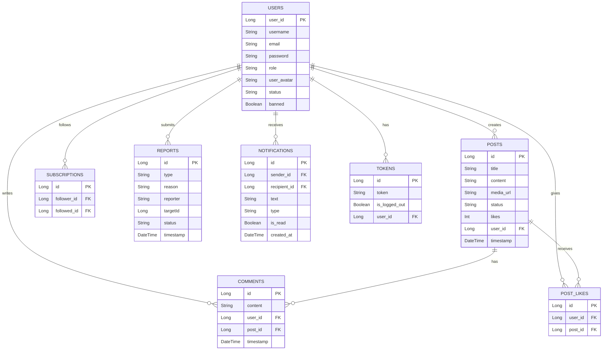

# 01BLOG — Full-Stack Blog Platform

A modern, full-stack blog platform built with **Angular 19** (frontend) and **Spring Boot 3** (backend), featuring user authentication, post creation with media, social interactions, admin moderation, and notifications.

---

## 🏗 Architecture Overview



---

## 📂 Project Structure

```
01BLOG/
├── Backend/backendblock/      ← Spring Boot API
│   └── src/main/java/com/project/block/
│       ├── Controllers/       ← REST endpoints
│       ├── entity/            ← JPA entities
│       ├── dto/               ← Data transfer objects
│       ├── models/            ← Business logic services
│       ├── repository/        ← Database repositories
│       ├── config/            ← Security & CORS config
│       └── filters/           ← JWT authentication filter
│
├── Frentend/Myapp/            ← Angular 19 app
│   └── src/app/
│       ├── core/              ← Services, guards, models
│       ├── features/          ← Feature modules (pages)
│       ├── shared/            ← Reusable components
│       └── layout/            ← Navbar, footer
│
└── README.md                  ← This file
```

---

## 🔐 Authentication Flow



---

## 📡 API Endpoints Summary

### Auth (`/Auth`)
| Method | Endpoint | Description | Status Codes |
|--------|----------|-------------|--------------|
| POST | `/Register` | Register new user | 201, 400 |
| POST | `/Login` | Login & get JWT | 200, 400, 403, 500 |

### Users (`/api/users`)
| Method | Endpoint | Description | Status Codes |
|--------|----------|-------------|--------------|
| GET | `/me` | Current user profile | 200, 401, 500 |
| GET | `/{id}` | User profile by ID | 200, 404, 500 |
| PUT | `/update` | Update profile | 200, 400, 500 |
| POST | `/{id}/follow` | Toggle follow | 200, 400 |

### Posts (`/api/posts`)
| Method | Endpoint | Description | Status Codes |
|--------|----------|-------------|--------------|
| GET | `/` | All visible posts | 200, 500 |
| GET | `/{id}` | Single post (visibility enforced) | 200, 403, 404, 500 |
| GET | `/User/{userId}` | Posts by user | 200, 500 |
| POST | `/` | Create post | 201, 400, 500 |
| PUT | `/{id}` | Update post | 200, 400, 403, 500 |
| DELETE | `/{id}` | Delete post | 200, 403, 404, 500 |
| POST | `/{id}/like` | Toggle like | 200, 500 |

### Comments (`/api/comments`)
| Method | Endpoint | Description | Status Codes |
|--------|----------|-------------|--------------|
| GET | `/post/{postId}` | Get comments for post | 200, 500 |
| POST | `/post/{postId}` | Add comment | 201, 400, 404 |

### Notifications (`/api/notifications`)
| Method | Endpoint | Description | Status Codes |
|--------|----------|-------------|--------------|
| GET | `/` | Get all notifications | 200, 500 |
| PUT | `/{id}/read` | Mark as read | 200, 500 |
| PUT | `/read-all` | Mark all as read | 200, 500 |

### Reports (`/api/reports`)
| Method | Endpoint | Description | Status Codes |
|--------|----------|-------------|--------------|
| POST | `/` | Submit report | 201, 400, 500 |

### Admin (`/api/admin`) — requires ADMIN role
| Method | Endpoint | Description | Status Codes |
|--------|----------|-------------|--------------|
| GET | `/users` | All users | 200, 500 |
| POST | `/users/{id}/ban` | Toggle ban | 200, 400, 404, 500 |
| DELETE | `/users/{id}` | Delete user | 200, 400, 500 |
| GET | `/posts` | All posts | 200, 500 |
| PUT | `/posts/{id}/status` | Change post status | 200, 500 |
| DELETE | `/posts/{id}` | Delete post | 200, 500 |
| GET | `/reports` | All reports (enriched) | 200, 500 |
| DELETE | `/reports/{id}` | Resolve report | 200, 500 |

### Other
| Method | Endpoint | Description | Status Codes |
|--------|----------|-------------|--------------|
| GET | `/token/validate` | Validate JWT | 200, 401 |
| GET | `/files/{filename}` | Serve uploaded file | 200, 404, 500 |

---

## 🗃 Database Schema



---

## 🚀 Quick Start

### Prerequisites
- **Java 21** + Maven
- **Node.js 18+** + npm
- **MySQL / MariaDB**

### Backend
```bash
cd Backend/backendblock
mvn spring-boot:run
# Runs on http://localhost:8080
```

### Frontend
```bash
cd Frentend/Myapp
npm install
ng serve
# Runs on http://localhost:4200
```

---

## 🔒 Security
- JWT-based authentication via `JwtFilter`
- Role-based access control (`USER`, `ADMIN`)
- Admin endpoints protected with `@PreAuthorize("hasRole('ADMIN')")`
- Token validation on every authenticated request
- Password encryption via BCrypt
